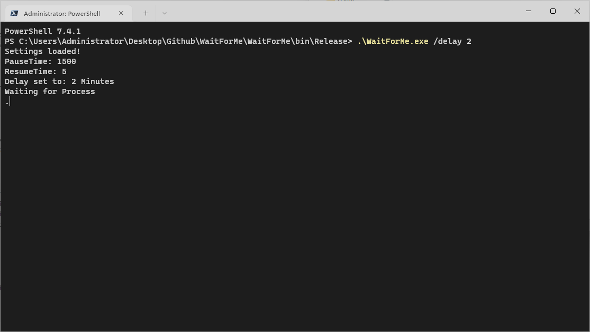

# WaitForMe



## Overview

WaitForMe is a simple console application designed to delay the loading phase of the popular game "League of Legends" by up to 4 minutes.
This allows players to have extra time for other activities before the game begins. Whether you need a few more minutes to grab a snack, answer a quick email, or just relax, WaitForMe has got you covered.

## How It Works

The application works by suspending and resuming the loading process of the game, providing users with the flexibility to extend the wait time before entering the virtual battlefield.
It is important to note that this tool is intended for personal use and should be used responsibly.

## Key Features:

- **Priority Control:** Changed the priority of the game.
- **Suspend & Resume:** That way you won't get kicked.
- **Exception Handling:** The game will be reset to the normal state in any case, even if you close it.
- **Settings:** You can adjust the application according to your computer speed.
- **User-Friendly:** Can be started directly or with parameters.

## Usage

1. Download the latest release from the [Releases](https://github.com/Sarotin/WaitForMe/releases) page.
2. Extract the contents of the zip file to a location of your choice.
3. Open a command prompt or terminal in the extracted folder.
4. Run in Terminal:
   ```bash
   .\WaitForMe.exe /delay 2

## Settings

You can customize the application settings by editing the Settings.config file. The default settings are:

    ResumeTime: 5     |Note:seconds      - Running x Seconds before Pausing again.
    PauseTime:  1000  |Note:milliseconds - Pausing x milliseconds before Resuming again.

To modify these settings, open the Settings.config and adjust it according to your computer speed.

## Dependencies
Microsoft .NET 4.7.2 Runtime. You can download it [here](https://dotnet.microsoft.com/en-us/download/dotnet-framework/net472) 

## Important Note

Feel free to contribute to the project by forking the repository and submitting pull requests. If you encounter any issues or have suggestions for improvement, please open an issue.
License

This project is licensed under the MIT License, granting you the freedom to modify and distribute the code for personal use.

Happy gaming, and enjoy your extra time with WaitForMe!
